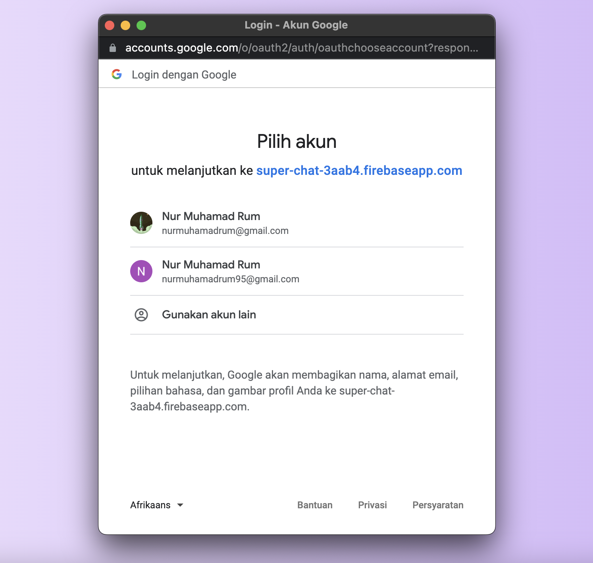
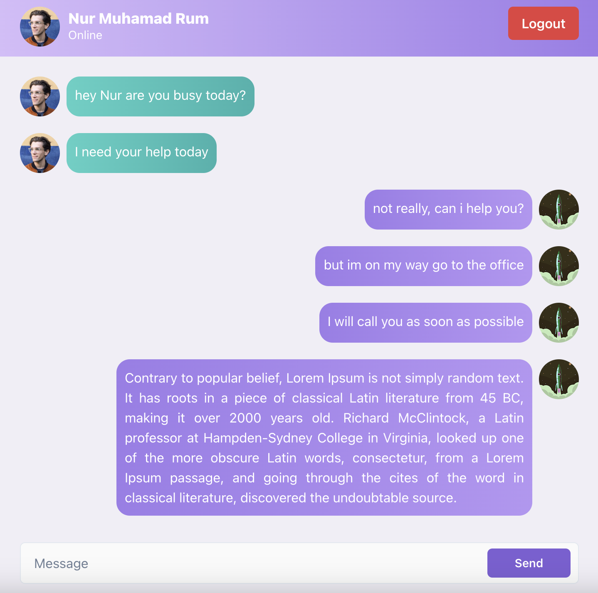
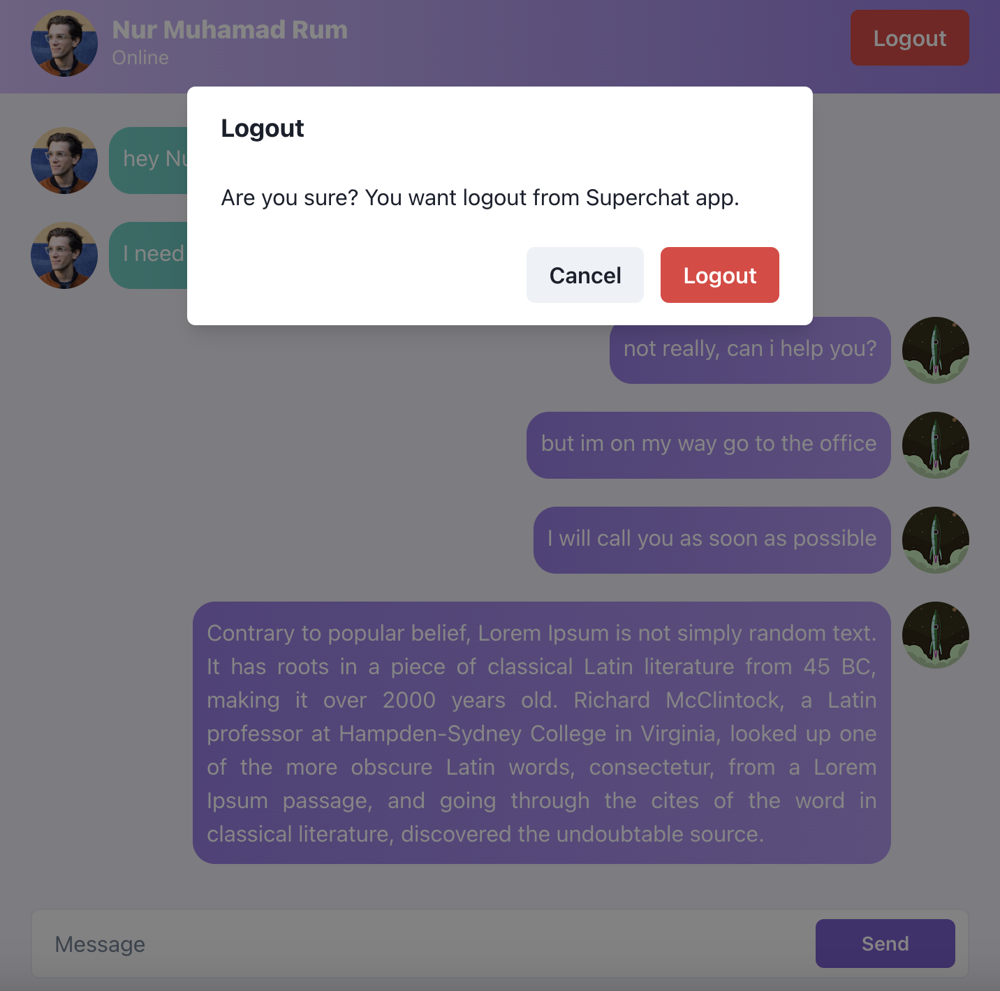

# REACT SUPER CHAT REALTIME

## Table of Contents

- [Getting Started](#getting-started)
  - [Prerequisites](#prerequisites)
  - [Installation](#installation)
- [Screenshots](#screenshots)
- [Built With](#built-with)
- [Author](#author)

## Getting Started

Before starting to install the project, there're some things that need to be done first.

### Prerequisites

Make sure all of these are properly installed in your system.

| Application  | Download                                                                            |
| ------------ | ----------------------------------------------------------------------------------- |
| Git          | [Windows](https://gitforwindows.org/) / [Linux](https://git-scm.com/download/linux) / [MacOS](https://git-scm.com/download/mac) |
| ReactJs | [Link](https://reactjs.org/docs/getting-started.html) |
| Chakra UI | [Link](https://chakra-ui.com/getting-started) |
| Firebase | [Link](https://console.firebase.google.com/) |

## Installation
### How to Installation & Running App Application Localy

First, clone this repository into your system.

```
git clone https://github.com/nurmuhamadrum/react-super-chat-realtime.git
```

Then, install all the packages that described in `package.json`.

```
npm install
```

Then, run the web application`.

```
npm run start
```

After npm run start get proccess is done then run your localhost. Wait till the Web application is running. Now, you can explore the Web Application and its features. Enjoy!
## Screenshots

<div style={{ display: 'flex' }}>
    
    
    
    
</div>

## Built With

- [REACTJS](https://reactjs.org/) - REACT JS
- [CHAKRAUI](https://chakra-ui.com/) - UI FRAMEWORK
- [FIREBASE](https://console.firebase.google.com/) - FIRESTORE

## Author

**Nur Muhamad Rum** - www.nurmuhamadrum.site
